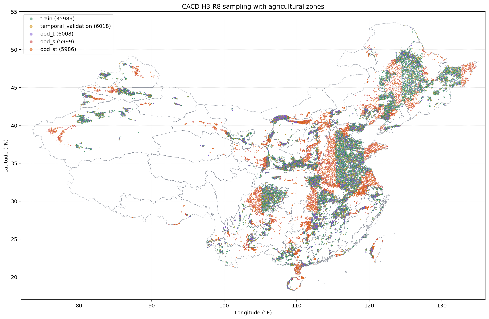
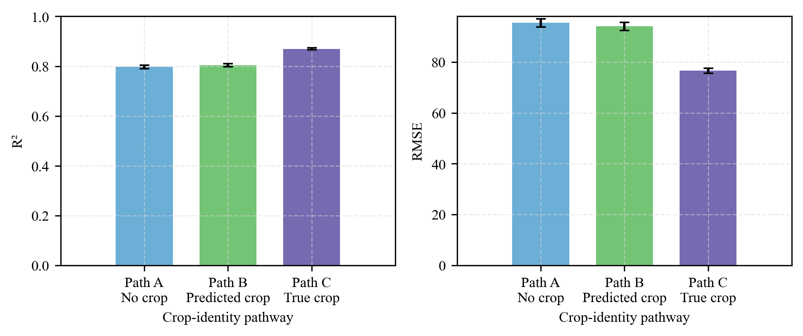
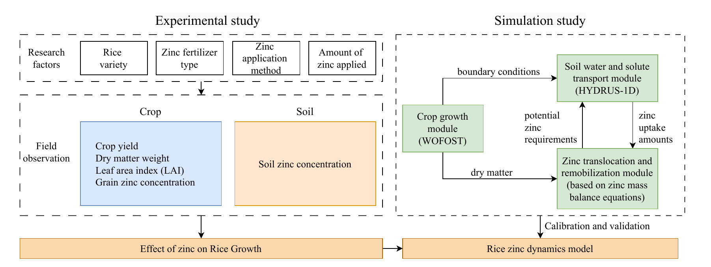

::: {.hero}
::: {.hero-grid}
::: {.hero-photo-wrap}
{.profile-photo}
:::

::: {.hero-copy}
::: {.hero-position}
PhD Candidate
:::

# Shenzhou Liu

::: {.hero-email}
Email: [shenzhouliu@whu.edu.cn](mailto:shenzhouliu@whu.edu.cn)
:::

::: {.hero-affiliation}
**Wuhan University**  
School of Water Resources and Hydropower Engineering
:::

I study how multimodal Earth observation data can be transformed into robust and transferable representations for agricultural and environmental applications. My research focuses on multimodal spatiotemporal representation learning for Earth observation, process-based crop growth modeling, and high-resolution crop yield prediction.

::: {.hero-contact}
[Google Scholar](https://scholar.google.com/citations?user=SPt69WYAAAAJ&hl=zh-CN) · [LinkedIn](https://www.linkedin.com/in/shenzhou-liu-5299872b6/) · [ORCID](https://orcid.org/0009-0007-5718-978X)
:::

::: {.hero-actions}
[Research](research.qmd){.btn .btn-primary}
:::
:::
:::
:::

::: {.content-section .selected-section}
## Representative Publications

::: {.selected-output-list}
::: {.selected-output}
::: {.selected-year}
2026
:::
::: {.selected-citation}
[A process-based mechanistic modeling framework for soil–plant zinc dynamics and rice zinc biofortification](https://doi.org/10.1016/j.compag.2026.112134){.selected-title} · *Computers and Electronics in Agriculture*
:::
:::

::: {.selected-output}
::: {.selected-year}
2025
:::
::: {.selected-citation}
[MT-CYP-Net: Multi-task network for pixel-level crop yield prediction under very few samples](https://doi.org/10.1016/j.jag.2025.104748){.selected-title} · *International Journal of Applied Earth Observation and Geoinformation*
:::
:::

::: {.selected-output}
::: {.selected-year}
2021
:::
::: {.selected-citation}
[Simulating the Leaf Area Index of Rice from Multispectral Images](https://doi.org/10.3390/rs13183663){.selected-title} · *Remote Sensing*
:::
:::
:::

[View all publications →](publications.qmd){.text-link .selected-all-link}
:::

::: {.content-section .featured-section}
## Featured Research

::: {.project-order-note}
Ordered by project start date
:::

::: {.project-grid}
::: {.project-card}
::: {.project-visual}

:::

### Meteo-STE

::: {.project-date}
2026.05–Present
:::

**Multimodal Spatiotemporal Representation Learning for Earth Observation**

Meteo-STE studies how satellite observations and environmental forcing can be jointly represented across space and time. The framework is designed to support filtering, forecasting, and temporal querying within a unified representation-learning formulation.

::: {.card-actions}
[Project](projects/meteoste.qmd){.btn .btn-sm .btn-primary}
:::
:::

::: {.project-card}
::: {.project-visual}

:::

### MT-CYP-Net

::: {.project-date}
2023.12–2025.08
:::

**Pixel-level Crop Yield Prediction under Limited Samples**

MT-CYP-Net investigates high-resolution crop yield prediction when pixel-level yield labels are scarce. It jointly learns crop type and crop yield through shared spatial representations, enabling crop-aware yield estimation under limited supervision.

::: {.card-actions}
[Project](projects/mt-cyp-net.qmd){.btn .btn-sm .btn-primary}
[Paper](https://doi.org/10.1016/j.jag.2025.104748){.btn .btn-sm .btn-outline-secondary}
:::
:::

::: {.project-card}
::: {.project-visual}

:::

### Multi-Crop Yield Benchmark

::: {.project-date}
2021.12–2025.12
:::

**Unified Evaluation of Multi-source Crop Yield Prediction**

This work examines crop yield prediction across multiple crop types using remote sensing, meteorological, and static environmental variables under a unified evaluation framework. It focuses on the contribution of different information sources, crop identity, modeling strategies, and temporal transfer.

::: {.card-actions}
[Project](projects/multi-crop-yield.qmd){.btn .btn-sm .btn-primary}
:::
:::

::: {.project-card}
::: {.project-visual}

:::

### Rice Zinc Dynamics Model

::: {.project-date}
2020.05–2022.05 · Publication: 2026
:::

**Process-based modeling of soil-plant zinc dynamics and rice zinc biofortification**

RZDM couples crop growth, soil water and solute transport, and zinc translocation-remobilization to examine zinc movement across the soil-plant-grain continuum and evaluate management scenarios for rice biofortification.

::: {.card-actions}
[Project](projects/rzdm.qmd){.btn .btn-sm .btn-primary}
[Paper](https://doi.org/10.1016/j.compag.2026.112134){.btn .btn-sm .btn-outline-secondary}
:::
:::
:::
:::
