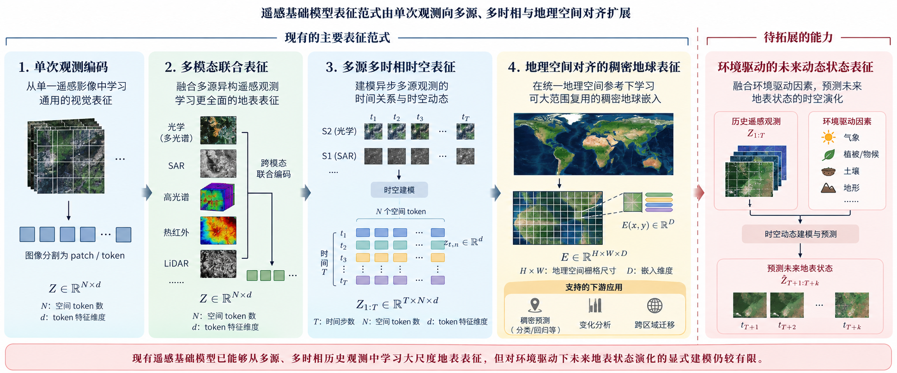

::: {.project-date}
2026.05–Present
:::

{.hero-figure}

## Motivation

Earth observation time series combine asynchronous sensors, long temporal spans, missing observations, and cloud contamination. This project investigates how terrain, weather, and remote-sensing observations can support a continuous spatiotemporal model for filtering, forecasting, and smoothing within one framework.

## Method

The framework estimates system states at arbitrary spatial locations and target times, then produces temporally dense embeddings for downstream agricultural applications. Current experiments combine Sentinel-1/2 imagery with meteorological and static environmental information.

{.evidence-figure}

## Preliminary Results

Initial experiments show that compressed latent representations can reconstruct NDVI while preserving vegetation condition and spatial structure. A China cropland monitoring dataset has been assembled with 60,000 sample locations, each containing 210 days of Sentinel-1/2 and meteorological observations. On the GreenEarthNet OOD-t NDVI forecasting task, the current preliminary result is RMSE = 0.165 and R² = 0.639.

## Resources

::: {.resource-grid}
Resources will be released when they are ready for public use.
:::
