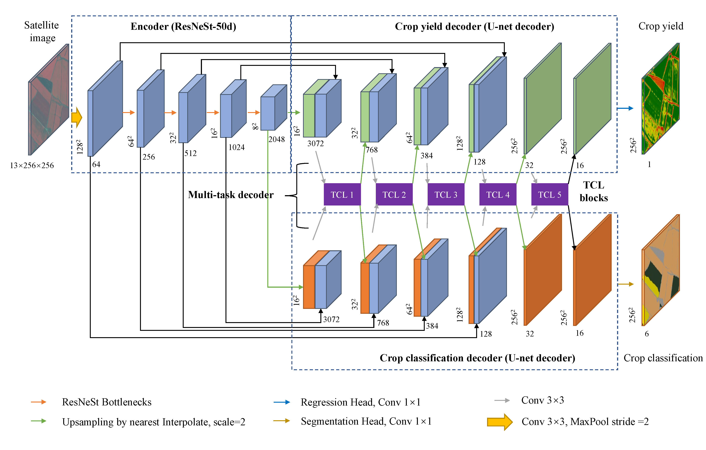
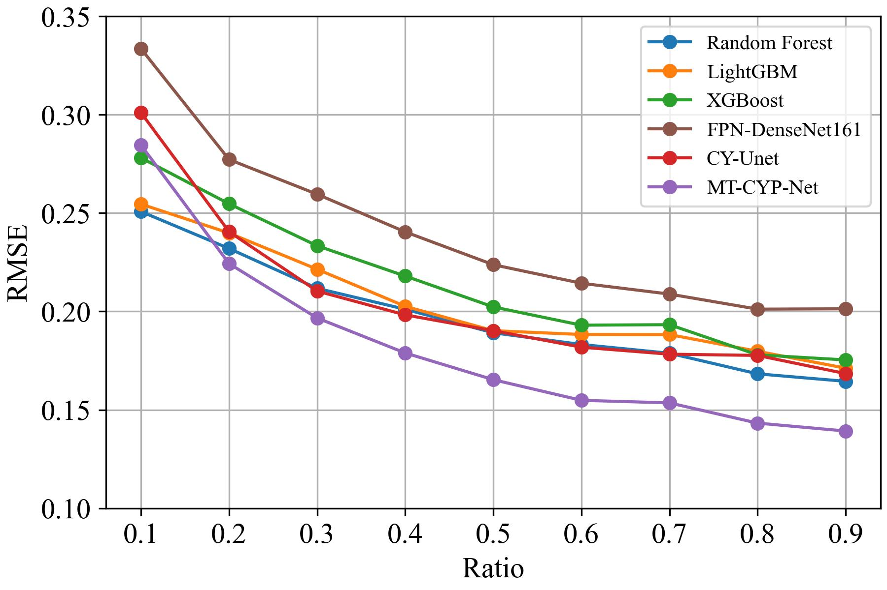
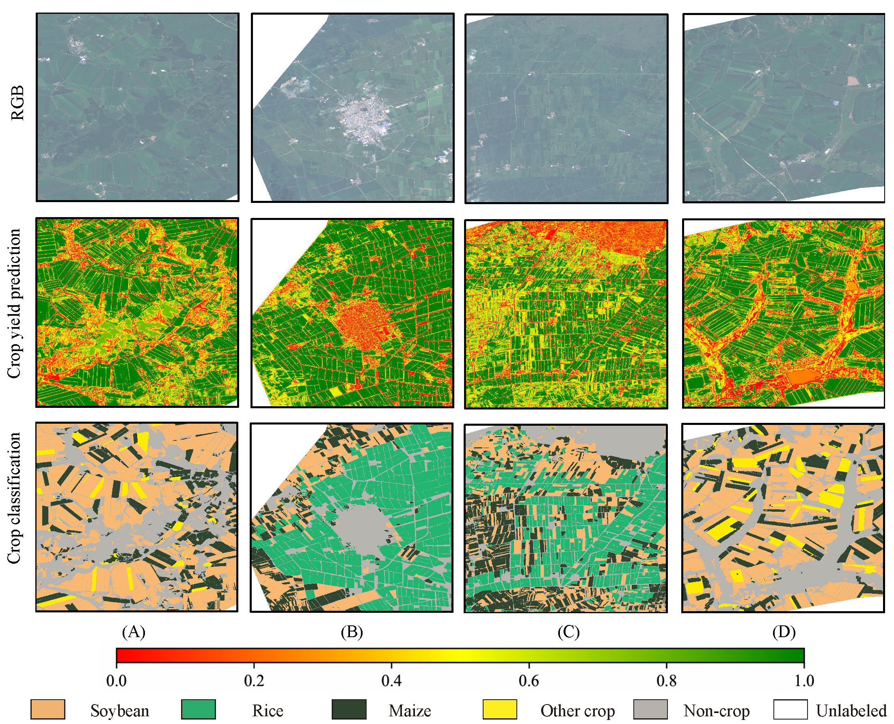

::: {.project-date}
2023.12–2025.08
:::

{.hero-figure}

## Motivation

Pixel-level crop-yield mapping is constrained by the high cost of field measurements and the resulting scarcity of yield labels. The project investigates whether crop-type supervision can provide an additional learning signal when only a very small number of yield samples are available.

## Method

MT-CYP-Net is a multi-task learning framework that uses crop classification as an auxiliary task for pixel-level yield prediction. The study evaluates soybean, maize, and rice mapping under limited yield supervision using satellite and environmental observations.

## Key Results

The reported evaluation achieved RMSE = 0.1472 and MAE = 0.0706 under the study protocol. The resulting method was published in the *International Journal of Applied Earth Observation and Geoinformation*.

::: {.evidence-grid}
{.evidence-figure}

{.evidence-figure}
:::

## Resources

::: {.resource-grid}
[Paper](https://doi.org/10.1016/j.jag.2025.104748){.resource-button}
:::
