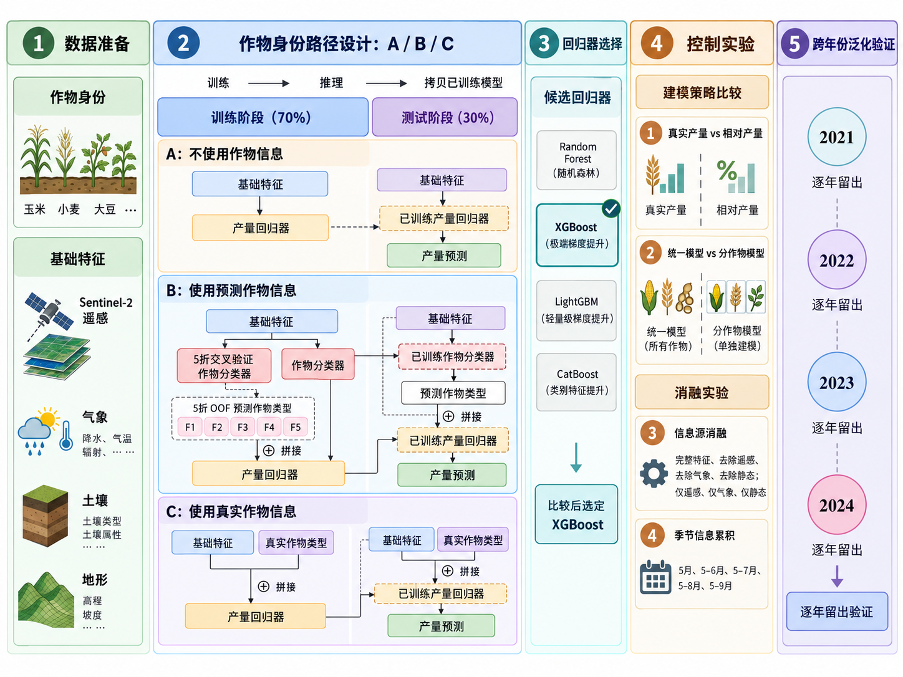
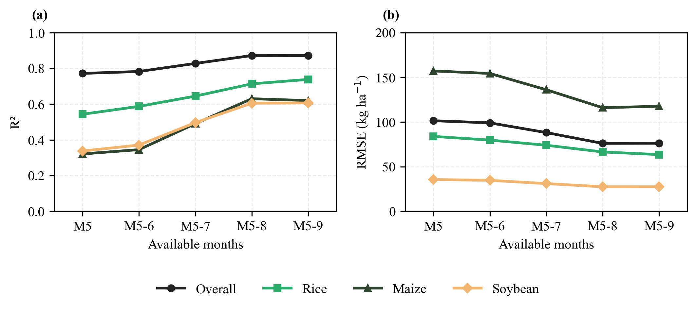

::: {.project-date}
2021.12–2025.12
:::

{.hero-figure}

## Motivation

Multi-crop yield studies often mix datasets, input sources, validation years, and model settings, making practical predictability difficult to compare. This project establishes a controlled framework for assessing model performance and generalization boundaries.

## Method

Yield labels for rice, maize, and soybean from 2021–2024 are matched with Sentinel-2, ERA5-Land, OpenLandMap, soil, and terrain data. The benchmark compares Random Forest, XGBoost, LightGBM, and CatBoost, with SHAP analysis, source ablation, temporal accumulation experiments, and cross-year validation.

## Key Results

The associated manuscript, “Exploring the Practical Predictability of Pixel-Level Multi-Crop Yields Using a Controlled Machine Learning Framework,” is currently under review at *Agronomy Journal*. Verified benchmark tables and final quantitative conclusions will be added after peer review.

::: {.evidence-grid}
{.evidence-figure}

{.evidence-figure}
:::

## Resources

::: {.resource-grid}
Resources will be added after peer review and public release.
:::
