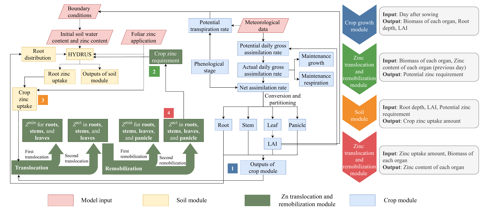
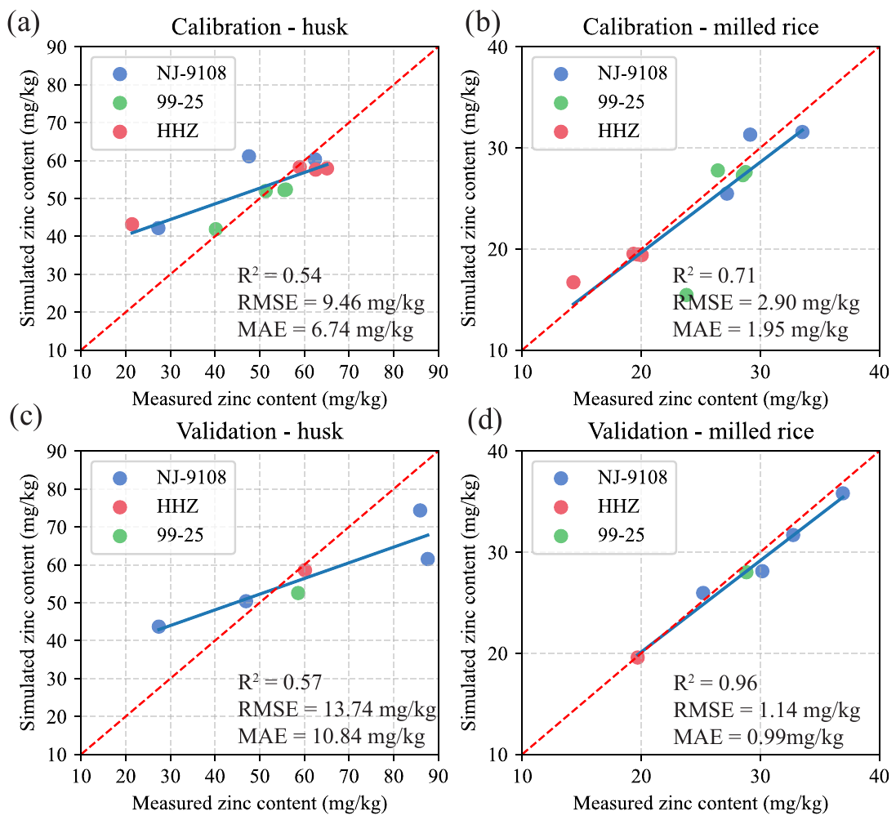
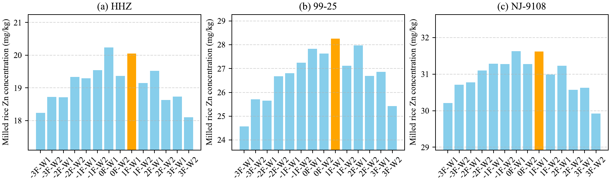

::: {.project-date}
2020.05–2022.05 · Publication: 2026
:::

{.hero-figure}

## Motivation

Rice zinc biofortification depends on interacting soil, crop-growth, uptake, translocation, and management processes. Empirical relationships can describe observed treatment responses, but they do not explicitly represent zinc movement across the soil-plant-grain continuum. This project develops a process-based framework for interpreting those dynamics and exploring management scenarios.

## Method

The Rice Zinc Dynamics Model (RZDM) couples three components:

- **WOFOST** for crop phenology, biomass production, organ partitioning, and root development;
- **HYDRUS-1D** for soil water flow, solute transport, and root zinc uptake;
- a **zinc translocation-remobilization module** for organ-level zinc requirements, allocation, and redistribution during crop development.

Field observations from 17 plots covered three rice varieties, three zinc fertilizers, and soil and foliar application strategies. These data were used to calibrate and evaluate crop growth, soil zinc, and grain zinc simulations.

{.evidence-figure}

## Key Results

- Foliar zinc application produced stronger grain-zinc enrichment than soil application under the tested conditions; Zn-SA and zinc sulfate were generally more effective than Zn-EDTA.
- RZDM reproduced crop-growth indicators with R² values of 0.45-0.96. For grain zinc, validation R² was 0.57 for husk and 0.96 for milled rice; soil-zinc prediction remained a clear limitation.
- Scenario simulations indicated that weekly foliar zinc sulfate or Zn-SA application beginning one week after flowering had potential to improve grain zinc concentration under the study conditions.

These findings are based on a single-site, single-season experiment with limited independent experimental units. Scenario results therefore require validation across additional environments, soils, cultivars, and years.

::: {.evidence-grid}
{.evidence-figure}

{.evidence-figure}
:::

## Publication

**Liu, S.**, Zeng, W., Lei, G., & Huang, J. (2026). A process-based mechanistic modeling framework for soil-plant zinc dynamics and rice zinc biofortification. *Computers and Electronics in Agriculture*, 253, 112134. [https://doi.org/10.1016/j.compag.2026.112134](https://doi.org/10.1016/j.compag.2026.112134)

## Resources

::: {.resource-grid}
[Paper](https://doi.org/10.1016/j.compag.2026.112134){.resource-button}
:::
